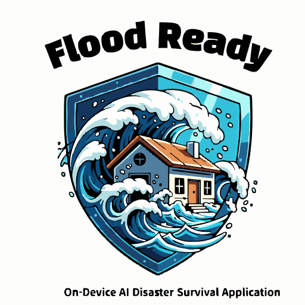
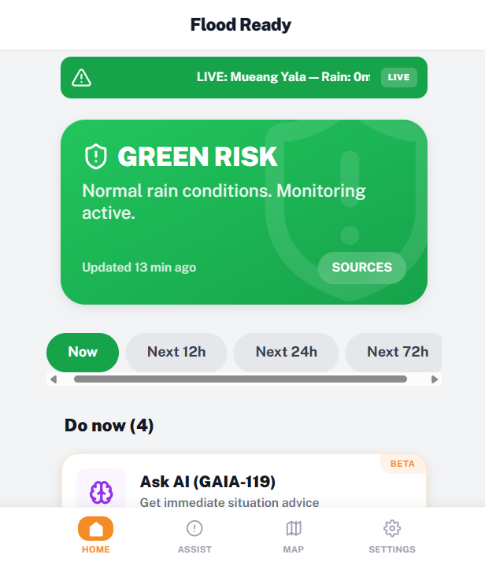
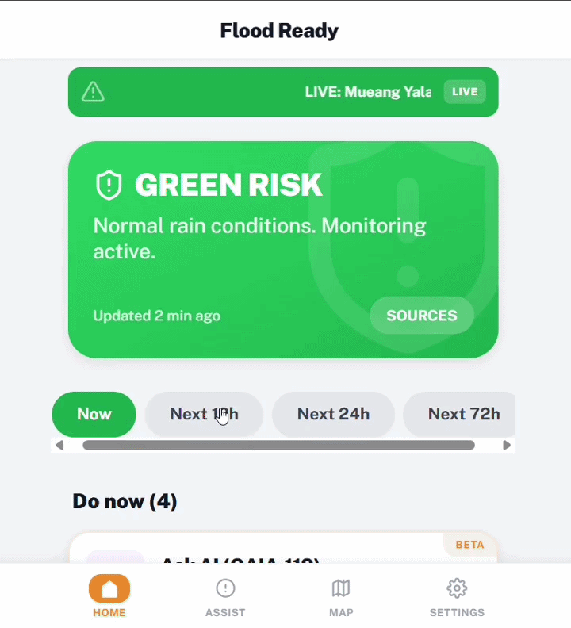

# Flood Ready (v0.6.2)

<p align="center">
  
</p>

> **"A True Offline-First, On-Device AI Disaster Survival Application"**


<p align="center">
  <strong>Live:</strong> <a href="https://flood-ready.vercel.app">https://flood-ready.vercel.app</a>
</p>

**Flood Ready** is a hyper-localized, offline-first emergency response PWA built for the Yala region (Thailand). It combines **Cognitive Engineering**, **True On-Device AI** (Qwen2.5 1.5B via WebLLM/WebGPU), the **GAIA-119 intent-based AI persona**, and **QR-P2P device-to-device communication** to maximize survival rates when cell towers, power, and internet all fail simultaneously.

---

## Product Preview

<p align="center">
  
</p>

Flood Ready home screen showing live flood risk, forecast windows, immediate actions, and direct access to GAIA-119.

## Demo

<p align="center">
  
</p>

The live demo shows the core survival flow: risk-aware home dashboard, AI assistance, Quick Assist, map, and offline QR communication.

---

## Core Philosophy: "Verification & Survival"

Every button, color, and interaction is engineered to save lives under extreme cognitive load. The guiding axiom: **on-board AI only** — no cloud dependency, no remote inference fallback. The entire intelligence stack runs on the user's device.

---

## Key Features

### GAIA-119 On-Device Emergency AI (Streaming)
An intent-based AI persona built on CR-EP and AESE-CrisisShield + ResponseFusion frameworks. Delivers survival-critical instructions in English, Thai, and Malay — auto-detected from raw user input. Streams token-by-token via WebGPU (first token ~2s). Every response is structured JSON: `{ level, actions[], treeId?, searchQuery }`.

**SITUATION OVERRIDE**: User's explicit emergency signals always override passive sensor/weather context. "Water entering house" → RED, regardless of `[WEATHER: Rain 0mm]`.

**treeId Validation**: AI-suggested decision tree routes are validated client-side against `decisionTreeData.nodes` before the CTA button renders — prevents hallucinated dead-ends.

### True Offline-First AI Architecture
Downloads **`Qwen3-1.7B-q4f16_1-MLC`** (~1.1GB) into the browser's IndexedDB via WebGPU. Primary inference runs 100% offline via WebLLM with real-time streaming. Fallback chain: WebLLM → Ollama (dev-optional) → Offline keyword dictionary. **Note: WebGPU required — desktop Chrome/Edge recommended. iOS devices fallback to offline dictionary automatically.**

### Real-Time 72h Forecast Intelligence
A single Open-Meteo API request supplies both current conditions and a 72-entry hourly precipitation array. `ThemeContext` computes `forecastRisk` and `forecastMaxRain` for three windows (12h / 24h / 72h) using WMO + Thai Met Dept peak precipitation thresholds:

| Rain Rate | Risk Level |
|-----------|-----------|
| < 1 mm/h | GREEN |
| 1 – 5 mm/h | YELLOW |
| 5 – 15 mm/h | ORANGE |
| ≥ 15 mm/h | RED |

Home screen tabs (`Now`, `Next 12h`, `Next 24h`, `Next 72h`) display real forecast risk sourced live from ThemeContext — no hardcoded values. The Live Alert Ticker shows: `"FORECAST NEXT 24H: Yala — Peak rain: 0.1mm/h · No significant rain · GREEN RISK"`.

### QR-P2P Offline Communication
True device-to-device data transfer with zero infrastructure — no internet, no Bluetooth, no server. This is not a background mesh daemon. It is a deliberate **line-of-sight emergency relay system**: one device shows a QR code, another device scans it, then optionally re-broadcasts it onward.

The system is built for the exact failure mode where towers are down, power is unstable, and strangers may still be physically near each other. In that environment, the most reliable transport is often simply **screen to camera**.

Three payload types:

- **SOS Beacon**: Encodes situation text + GPS coordinates + household/medical profile into a QR code. Show the screen to anyone with a camera.
- **Hub Status**: Encodes a registered safe hub (name, coordinates, status, services). Anyone who scans it adds the hub to their local map instantly.
- **Relay Chain**: After scanning a received QR, one tap re-wraps it as a relay payload (hop+1). Creates a "telephone chain" that propagates data across completely offline phones. Capped at 5 hops.

How it behaves in practice:

- **SOS is compact and fast**: short message, optional GPS, household tag, medical-needs flag.
- **Hub QR is operational data**: name, coordinates, status, services, hub type.
- **Relay preserves origin**: the original SOS or hub payload is kept inside the relay wrapper, with hop count added.
- **Age matters**: SOS and relay payloads are treated as stale after 2 hours; hub payloads after 6 hours.
- **Import is local-first**: scanned hub data is written directly into the receiver's local hub map, even if they have no network.
- **No extra scanner library**: scanning uses the native **Web `BarcodeDetector` API**; generation uses `qrcode.react` SVG output.

Protocol constraints are intentional:

- Payloads are compact JSON for QR density and quick scanning
- Relay hops are capped at 5 to limit stale propagation
- This is an infrastructure-free fallback, not a replacement for a true radio or mesh stack

The value of this system is not "high throughput." The value is that one phone can still move survival-critical data to the next phone when everything else is failing.

### Quick Assist — 24-Card Library + Priority Right Now
Risk-stratified 3-layer guidance system:
- **Priority Right Now**: 6–8 cards computed from current risk level + household profile. Zero AI required.
- **Browse All**: 24 categorized cards across 6 domains (Flood & Water, Medical, Supplies, Shelter, Communication, Family & Vulnerable). Routes to decision trees, AI queries, or direct navigation.
- **AI Insight Mid-Flow**: `aiHint` cards appear inline at critical decision tree nodes — context-aware survival tips in EN/TH/MS.

### Safe Hub Map
Interactive hub map with region-aware sorting, status indicators (Open/Full/Closed/Unknown), service icons, and Google Maps deep-link integration. Community-submitted hubs (via QR-P2P or in-app registration) are visually distinguished from admin-verified data.

**Swipe-to-action (mobile):** Swipe left on any hub card to reveal action buttons:
- **Bookmark** — pins the hub; bookmarked hubs surface first in the Home screen Safe Hub Locator
- **Edit** — update hub status and available services (crowdsourced community report)
- **Delete** — remove the hub (community-registered hubs only)

**Hover-to-action (desktop):** Hover over any hub card to reveal the same three action buttons at the bottom of the card.

### PWA Architecture
Entire application shell (HTML/JS/CSS) cached via Service Worker. App boots instantly at `0 bytes/sec`. WebGPU model cached in IndexedDB after first download.

---

## GAIA-119 — On-Device Emergency Intelligence

GAIA-119 is the AI persona powering the `Ask AI (GAIA-119)` feature. Not a generic chatbot — engineered as a **Thai National Disaster Response AI (AESE-CrisisShield)** with a fixed mission: deliver survival-critical action orders in under 5 seconds.

**Design principles:**
- **CR-EP Why Framework**: Every output constraint is anchored to a measurable survival goal (≤12 words/action, decision < 5 seconds)
- **5-Module AESE Pipeline**: EmergencySignalScanner → UrgencyClassifier → CalmToneInfuser → CognitiveFocusRedirector → ContactProtocolRecommender
- **ResponseFusion Dual-Pipeline**: Calm-sounding inputs scanned for hidden crisis signals before urgency classification
- **SITUATION OVERRIDE**: Explicit user situation always overrides passive sensor context
- **Zero-drift multilingual output**: 3-language few-shot examples (EN/TH/MS) ensure consistent JSON structure

See [`docs/gaia-119.md`](./docs/gaia-119.md) for the full technical specification.

---

## Tech Stack

| Layer | Technology |
|-------|-----------|
| Frontend | React 19 + TypeScript + Vite 7 |
| Styling | Tailwind CSS 3 |
| Routing | React Router v7 |
| AI Engine | @mlc-ai/web-llm (WebGPU) |
| AI Model | Qwen3-1.7B-q4f16_1-MLC (~1.1GB) |
| AI Persona | GAIA-119 (AESE-CrisisShield + ResponseFusion) |
| Weather API | Open-Meteo (free, no API key, 72h forecast) |
| QR Generate | qrcode.react (SVG) |
| QR Scan | Web BarcodeDetector API (native, no library) |
| Offline | PWA + Service Worker + Cache API + IndexedDB |
| Icons | Lucide React |

---

## Documentation (`/docs`)

1. [**Core Technology**](./docs/core-technology.md) — WebLLM, Vite PWA, Streaming Architecture, Offline Fallback Chain, Real-Time Weather Intelligence
2. [**GAIA-119 AI Persona Spec**](./docs/gaia-119.md) — Intent-based persona ontology, AESE pipeline, context injection, rain threshold calibration
3. [**Usability & Cognitive Engineering**](./docs/usability.md) — ISO Safety Colors, Haptic design, Dynamic UI, Rain Mode accessibility
4. [**Usage Guide**](./docs/usage.md) — Onboarding, WebLLM initialization, Quick Assist flows, Forecast Tabs, Hub registration
5. [**dev.to Article**](./docs/devto-article.md) — Technical deep-dive: WebGPU streaming, GAIA-119 architecture, QR-P2P protocol, lessons learned
6. [**Bundle Optimization Roadmap**](/D:/Sanctum/Flamehaven/Flamehaven-ONDEVICE-AI/roadmaps/flood-ready-bundle-optimization.md) — Planned Vite chunk reduction strategy without changing product behavior

---

## Prerequisites

- **Node.js** >= 20 (required for Vite 7)
- **Browser**: Chrome 113+ or Edge 113+ (required for WebGPU on-device AI). Firefox not supported. Safari has experimental WebGPU support.
- **(Optional Dev)**: Ollama on port 11434 with `qwen3:1.7b` pulled

## Quick Start

```bash
# Install dependencies
npm install

# Start development server
npm run dev

# Build for production
npm run build
```

## Deployment

1. `npm run build` — generates `/dist`
2. Deploy `/dist` to any static edge host: **Vercel**, **Netlify**, **Cloudflare Pages**
3. **HTTPS required** — WebGPU and Service Workers only function over secure contexts

**Live deployment:** https://flood-ready.vercel.app

---

## Roadmap

The current roadmap for bundle-size reduction and Vite chunk optimization is now tracked in the `Flamehaven-ONDEVICE-AI` project:

- [**flood-ready-bundle-optimization.md**](/D:/Sanctum/Flamehaven/Flamehaven-ONDEVICE-AI/roadmaps/flood-ready-bundle-optimization.md)

This roadmap is explicitly scoped to performance delivery improvements. It does **not** propose removing on-device AI, changing GAIA-119 behavior, or weakening the offline-first emergency model.

---

## Known Limitations

- **AI Response Time**: WebGPU inference takes 15–30 seconds per response. Streaming delivers first tokens in ~2 seconds. Users are informed upfront.
- **WebGPU Requirement**: Chrome 113+ or Edge 113+ required. Fallback chain (Ollama → keyword dictionary) activates automatically on unsupported browsers.
- **Model Pre-download**: The ~1.1GB Qwen2.5-1.5B model must be downloaded before first use. Users who skip receive keyword-based fallback responses.
- **PWA Icons**: The PWA manifest uses a placeholder `vite.svg`. Replace with production icons (192×192, 512×512 PNG) before public release.
- **QR-P2P Relay**: Each relay hop requires physical camera scanning. Not a replacement for a full mesh protocol (e.g., libp2p, gun.js) — designed as an infrastructure-free fallback.

---

## AI Engine Field Notes — WebLLM Lessons Learned

> This section documents real-world findings from deploying on-device LLMs in a browser PWA context.
> It is intended to help other developers avoid the same pitfalls.

### Why Qwen3-1.7B Was Tested and Rolled Back

In v0.6.2, the AI engine was upgraded from **Qwen2.5-1.5B** to **Qwen3-1.7B** to take advantage of the newer architecture and reasoning capabilities. After real-world testing, the model was rolled back. Here is the documented reasoning:

| Issue | Detail |
|---|---|
| **Slower inference** | Qwen3 uses a hybrid thinking architecture. Even without explicit `<think>` output, prefill cost is higher than Qwen2.5. |
| **`/no_think` does not work in WebLLM** | The `/no_think` prefix works in HuggingFace/Ollama via chat template. In WebLLM MLC-compiled models, the chat template is baked at compile time — a text prefix in the user message is treated as literal input, not a control directive. |
| **`treeId` guided flow disappeared** | `max_tokens` was reduced from 200 → 130 to compensate for speed. The JSON output field `treeId` appears near the end of the response. At 130 tokens, it was consistently truncated — silently breaking the "Start Step-by-Step Guided Flow" feature. |
| **Quality regression** | Without thinking, Qwen3-1.7B produced lower-quality structured JSON than Qwen2.5-1.5B, which is specifically optimized for instruction-following. |

**Rollback decision**: Qwen2.5-1.5B with `max_tokens: 160` (was 200) provides better quality, faster inference, and reliable `treeId` generation.

### WebLLM On-Device AI — Known Hard Limits

These are fundamental constraints of running LLMs inside a browser via WebGPU:

1. **No chat template control at runtime** — Model behavior is frozen at MLC compile time. Parameters like thinking mode, system prompt format, and special tokens cannot be changed without recompiling the model.
2. **`treeId` JSON field placement matters** — Fields at the end of the JSON schema are the first to be cut when `max_tokens` is insufficient. Always validate the minimum token budget against your full schema.
3. **Small model + complex prompt = behavioral anchors** — For models ≤ 2B parameters, named module labels in the system prompt (e.g., `EmergencySignalScanner:`) act as behavioral anchors. Removing them for token savings causes quality regression. Tested and reverted (see `v-speed-s1` tag).
4. **iOS Safari / WKWebView** — `navigator.gpu` is undefined. WebGPU is unavailable. The fallback keyword dictionary activates automatically.
5. **First inference latency** — Even with a cached model, the first inference per session takes 15–30 seconds due to shader compilation. Subsequent calls are 5–10 seconds.

### Paths to Overcome These Limits

| Approach | Description | Complexity |
|---|---|---|
| **GAIA-119 Fine-tuning** | Fine-tune Qwen2.5 or Qwen3.5 on disaster Q&A data using [Unsloth](https://unsloth.ai) (free on Colab for ≤4B models). Export to GGUF, then convert to MLC for WebLLM. | High — MLC build pipeline is complex |
| **Server-side API** | Deploy fine-tuned GGUF via Ollama or llama-server on a VPS (~$5–10/month). Browser calls `fetch()` instead of WebGPU. Loses offline capability. | Medium |
| **Smaller model (0.6B–1B)** | A quantized 0.6B model with a tighter GAIA-119 prompt may outperform 1.5B in latency while maintaining acceptable quality. | Low |
| **Training data collection** | Log high-quality GAIA-119 responses now as a JSON dataset. Reuse for future fine-tuning without starting from scratch. | Very Low — start immediately |

### Recommended Model Selection Criteria for WebLLM PWAs

- ≤ **1.5B** parameters: Reliable on mid-range mobile (6GB RAM devices)
- **Instruction-tuned** variants only (not base models)
- **q4f16_1** quantization: Best quality/size tradeoff for mobile WebGPU
- Prefer models with MLC pre-compiled weights available on [mlc.ai/models](https://mlc.ai/models)
- Validate `max_tokens` against your **full JSON schema including all optional fields**
